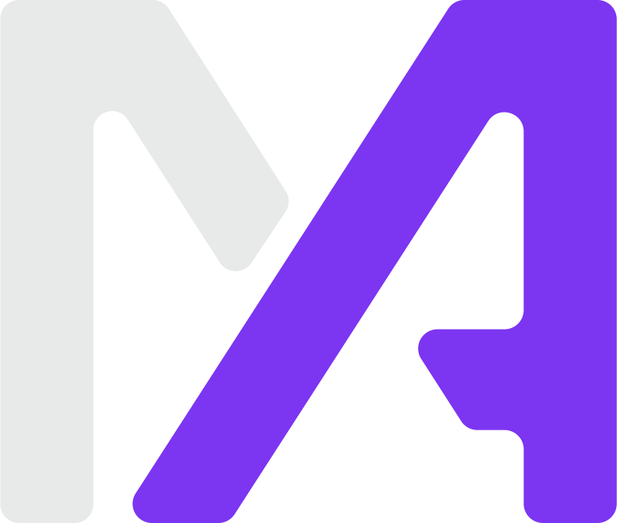

<h2> Hi, I'm Alessio Marchi</h2>
<p>
  <em>Senior Software Developer at <a href="http://accenture.com">Accenture</a>.</em></p>

<div>
  <a href="https://twitter.com/alessiom97"></a>
  <a href="https://www.linkedin.com/in/alessio-marchi-a007631b7/"></a>
  <a href="https://github.com/kettei-sproutty"></a>
</div>

```rust
let alessio = Developer {
  name: "Alessio Marchi".to_owned(),
  country: Country::Italy,
  city: City::Rome,
  code: vec!["Rust", "Typescript"],
};
```

<h2>About portfolio</h2>

Build with <a href="https://kit.svelte.dev/">SvelteKit</a> and <a href="https://tailwindcss.com/">TailwindCSS</a>.

<h3>TODOs</h3>

- [ ] Print PDF Resume without using `window.print`;
- [ ] Add a better responsive support on `about` page;
